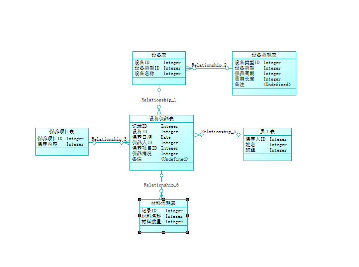
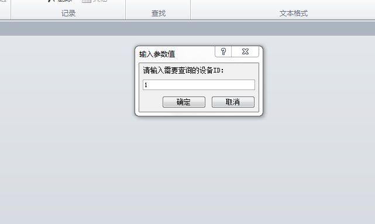
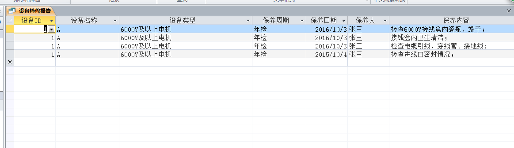
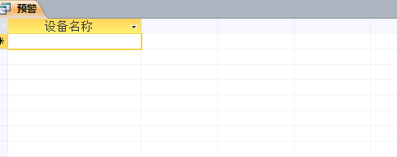

#设备保养系统报告
##ER图：
<html>
    <body>
        
    </body>
</html>
##SQL脚本：
if exists(select 1 from sys.sysforeignkey where role='FK_设备保养表_RELATIONS_设备表') then
    alter table 设备保养表
       delete foreign key FK_设备保养表_RELATIONS_设备表
end if;

if exists(select 1 from sys.sysforeignkey where role='FK_设备保养表_RELATIONS_保养项目表') then
    alter table 设备保养表
       delete foreign key FK_设备保养表_RELATIONS_保养项目表
end if;

if exists(select 1 from sys.sysforeignkey where role='FK_设备保养表_RELATIONS_员工表') then
    alter table 设备保养表
       delete foreign key FK_设备保养表_RELATIONS_员工表
end if;

if exists(select 1 from sys.sysforeignkey where role='FK_设备表_RELATIONS_设备类型表') then
    alter table 设备表
       delete foreign key FK_设备表_RELATIONS_设备类型表
end if;

drop table if exists 保养项目表;

drop table if exists 员工表;

drop index if exists 设备保养表.Relationship_3_FK;

drop table if exists 设备保养表;

drop table if exists 设备类型表;

drop index if exists 设备表.Relationship_1_FK;

drop table if exists 设备表;

/*==============================================================*/
/* Table: 保养项目表                                                 */
/*==============================================================*/
create table 保养项目表 
(
   保养项目ID               integer                        null,
   保养内容                 integer                        null,
   消耗材料名称               integer                        null,
   消耗材料数量               integer                        null
);

/*==============================================================*/
/* Table: 员工表                                                   */
/*==============================================================*/
create table 员工表 
(
   保养人ID                integer                        null,
   姓名                   integer                        null,
   班组                   integer                        null
);

/*==============================================================*/
/* Table: 设备保养表                                                 */
/*==============================================================*/
create table 设备保养表 
(
   记录ID                 integer                        null,
   设备ID                 integer                        null,
   保养日期                 date                           null,
   保养人ID                integer                        null,
   保养项目ID               integer                        null,
   保养情况                 integer                        null,
   备注                   char(10)                       null
);

/*==============================================================*/
/* Index: Relationship_3_FK                                     */
/*==============================================================*/
create index Relationship_3_FK on 设备保养表 (

);

/*==============================================================*/
/* Table: 设备类型表                                                 */
/*==============================================================*/
create table 设备类型表 
(
   设备类型ID               integer                        null,
   设备类型                 integer                        null,
   保养周期                 integer                        null,
   周期长度                 integer                        null,
   备注                   char(10)                       null
);

/*==============================================================*/
/* Table: 设备表                                                   */
/*==============================================================*/
create table 设备表 
(
   设备ID                 integer                        null,
   设备类型ID               integer                        null,
   设备名称                 integer                        null
);

/*==============================================================*/
/* Index: Relationship_1_FK                                     */
/*==============================================================*/
create index Relationship_1_FK on 设备表 (

);

alter table 设备保养表
   add constraint FK_设备保养表_RELATIONS_设备表 foreign key ()
      references 设备表
      on update restrict
      on delete restrict;

alter table 设备保养表
   add constraint FK_设备保养表_RELATIONS_保养项目表 foreign key ()
      references 保养项目表
      on update restrict
      on delete restrict;

alter table 设备保养表
   add constraint FK_设备保养表_RELATIONS_员工表 foreign key ()
      references 员工表
      on update restrict
      on delete restrict;

alter table 设备表
   add constraint FK_设备表_RELATIONS_设备类型表 foreign key ()
      references 设备类型表
      on update restrict
      on delete restrict;

##检修报告：
###SQL语句
SELECT 保养表.设备ID, 设备表.设备名称, 设备类型表.设备类型, 设备类型表.保养周期, 保养表.保养日期, 员工表.姓名 AS 保养人, 保养项目表.保养内容, 保养表.保养情况, 保养表.材料消耗
FROM 员工表 INNER JOIN ((设备类型表 INNER JOIN 设备表 ON 设备类型表.设备类型ID = 设备表.设备类型ID) INNER JOIN (保养项目表 INNER JOIN 保养表 ON 保养项目表.保养项目ID = 保养表.保养项目ID) ON 设备表.设备ID = 保养表.设备ID) ON 员工表.员工ID = 保养表.保养人ID
WHERE (((保养表.设备ID)=[请输入需要查询的设备ID：]));

<html>
    <body>
        
        
    </body>
</html>

##提前预警：
###SQL语句
SELECT 设备表.设备名称
FROM (设备类型表 INNER JOIN 设备表 ON 设备类型表.设备类型ID = 设备表.设备类型ID) INNER JOIN 保养表 ON 设备表.设备ID = 保养表.设备ID
WHERE (((设备类型表.周期长度)=Date()-[保养日期]+2));

<html>
    <body>
        
    </body>
</html>
