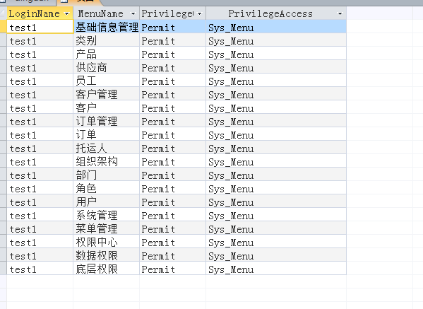
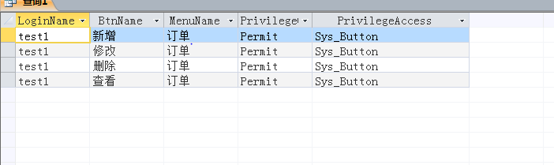

<html>
    <body>
SQL语句 
SELECT CF_User.LoginName, Sys_Menu.MenuName, CF_Privilege.PrivilegeOperation, CF_Privilege.PrivilegeAccess
FROM Sys_Menu INNER JOIN (((CF_UserRole INNER JOIN CF_Role ON CF_UserRole.RoleID = CF_Role.RoleID) INNER JOIN CF_User ON CF_UserRole.UserID = CF_User.UserID) INNER JOIN CF_Privilege ON CF_Role.RoleID = CF_Privilege.PrivilegeMasterKey) ON Sys_Menu.MenuID = CF_Privilege.PrivilegeAccessKey
WHERE (((CF_User.LoginName)="test1") AND ((CF_Privilege.PrivilegeOperation)="Permit") AND ((CF_Privilege.PrivilegeAccess)="Sys_Menu"));
 
伪代码:
1.根据名称（test1）查找人员编号UserID, 同时设定权限操作为允许PrivilegeOperation=”Permit”以及权限对象为按钮PrivilegeAccess="Sys_Menu"
2.根据人员编号UserID查找该人员所对应的角色编号RoleID（可能不止一个）
3.根据角色编号RoleID查找角色编号对应的权限编号PrivilegeMasterKey
4.根据权限编号PrivilegeMasterKey查找该权限的准入编号PrivilegeAccessKey
5.根据准入编号PrivilegeAccessKey查找出对应的页面名称MenuName
 
截图：
         
SQL语句 
SELECT CF_User.LoginName, Sys_Button.BtnName, Sys_Menu.MenuName, CF_Privilege.PrivilegeOperation, CF_Privilege.PrivilegeAccess
FROM (((CF_UserRole INNER JOIN CF_User ON CF_UserRole.UserID = CF_User.UserID) INNER JOIN CF_Role ON CF_UserRole.RoleID = CF_Role.RoleID) INNER JOIN CF_Privilege ON CF_Role.RoleID = CF_Privilege.PrivilegeMasterKey) INNER JOIN (Sys_Menu INNER JOIN Sys_Button ON Sys_Menu.MenuNo = Sys_Button.MenuNo) ON CF_Privilege.PrivilegeAccessKey = Sys_Button.BtnID
WHERE (((CF_User.LoginName)="test1") AND ((Sys_Menu.MenuName)="订单") AND ((CF_Privilege.PrivilegeOperation)="Permit") AND ((CF_Privilege.PrivilegeAccess)="Sys_Button"));

 
伪代码:
1.根据名称（test1）查找人员编号UserID, 同时设定权限操作为允许PrivilegeOperation=”Permit”，权限对象为按钮PrivilegeAccess="Sys_Button" 以及页面名称为订单Sys_Menu.MenuName="订单"
2.根据人员编号UserID查找该人员所对应的角色编号RoleID（可能不止一个）
3.根据角色编号RoleID查找角色编号对应的权限编号PrivilegeMasterKey
4.根据权限编号PrivilegeMasterKey查找该权限的准入编号PrivilegeAccessKey
5.根据准入编号PrivilegeAccessKey查找出对应的按钮名称ButtonName

 
截图：
        
    </body>
</html>
